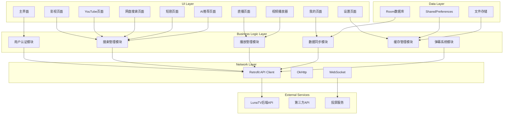
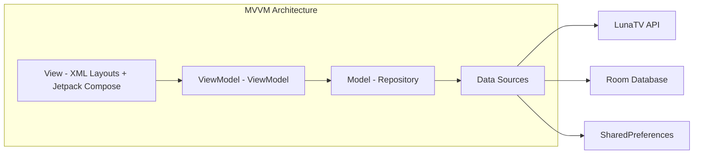

# LunaTV 安卓电视前端 - 技术设计文档

功能名称: android-tv-frontend
更新日期: 2026-02-28

## 描述

本设计文档定义了 LunaTV Enhanced Edition 后端的安卓电视原生前端应用。该应用使用现代安卓开发技术栈,专门针对电视大屏交互优化,提供流畅的原生体验。应用将完美集成 LunaTV 后端的所有功能,包括多源搜索、播放、直播、AI 推荐等。

## 架构

### 整体架构



### 应用架构模式



## 组件和接口

### 核心组件

#### 1. 用户认证组件 (AuthComponent)

**职责**: 管理用户登录、认证状态和会话管理

**接口**:
```kotlin
interface AuthService {
    suspend fun login(username: String, password: String): Result<UserSession>
    suspend fun loginWithOIDC(provider: String): Result<UserSession>
    suspend fun loginWithTelegram(magicLink: String): Result<UserSession>
    suspend fun logout()
    fun getCurrentUser(): User?
    fun isAuthenticated(): Boolean
    fun observeAuthState(): Flow<AuthState>
}

sealed class AuthState {
    object Unauthenticated : AuthState()
    object Loading : AuthState()
    data class Authenticated(val user: User) : AuthState()
    data class Error(val message: String) : AuthState()
}
```

**实现要点**:
- 使用 Kotlin Coroutines 进行异步认证
- Token 存储在 EncryptedSharedPreferences
- 支持自动刷新 Token
- 检测信任网络模式

#### 2. 搜索管理组件 (SearchComponent)

**职责**: 管理影视、YouTube、网盘、短剧等搜索功能

**接口**:
```kotlin
interface SearchService {
    suspend fun searchMovies(query: String, filters: SearchFilters): Flow<SearchResult>
    suspend fun searchYouTube(query: String, timeFilter: TimeFilter): Flow<YouTubeResult>
    suspend fun searchNetdisk(query: String, filters: NetdiskFilters): Flow<NetdiskResult>
    suspend fun searchShortDrama(query: String): Flow<ShortDramaResult>
    suspend fun getSearchHistory(): Flow<List<SearchHistoryItem>>
    suspend fun addToSearchHistory(item: SearchHistoryItem)
    suspend fun clearSearchHistory()
}
```

**实现要点**:
- 使用 Flow 进行流式搜索结果处理
- 实现虚拟滚动优化性能
- 支持繁体中文智能转换
- 实现搜索去重和智能排序

#### 3. 播放管理组件 (PlaybackComponent)

**职责**: 管理视频播放、播放源切换、播放记录

**接口**:
```kotlin
interface PlaybackService {
    suspend fun getVideoSources(videoId: String): Flow<List<VideoSource>>
    suspend fun playVideo(source: VideoSource, startTime: Long = 0)
    suspend fun seekTo(position: Long)
    suspend fun pause()
    suspend fun resume()
    suspend fun stop()
    suspend fun switchSource(newSource: VideoSource)
    fun observePlaybackState(): Flow<PlaybackState>
    suspend fun savePlaybackRecord(record: PlaybackRecord)
}

sealed class PlaybackState {
    object Idle : PlaybackState()
    object Loading : PlaybackState()
    data class Playing(val position: Long, val duration: Long) : PlaybackState()
    data class Paused(val position: Long, val duration: Long) : PlaybackState()
    data class Error(val message: String) : PlaybackState()
}
```

**实现要点**:
- 使用 ExoPlayer 作为播放引擎
- 支持多种视频格式(HLS、DASH、MP4)
- 实现播放进度自动保存
- 支持播放源智能切换
- 实现缓冲模式配置

#### 4. 直播管理组件 (LiveComponent)

**职责**: 管理 IPTV 直播、EPG 节目单

**接口**:
```kotlin
interface LiveService {
    suspend fun getLiveChannels(): Flow<List<LiveChannel>>
    suspend fun getEPG(channelId: String): Flow<EPGData>
    suspend fun playChannel(channel: LiveChannel)
    suspend fun searchChannels(query: String): Flow<List<LiveChannel>>
    fun observeCurrentProgram(): Flow<Program?>
}

data class LiveChannel(
    val id: String,
    val name: String,
    val logo: String?,
    val url: String,
    val isDirectPlay: Boolean,
    val categories: List<String>
)
```

**实现要点**:
- M3U/M3U8 文件解析
- EPG XML 解析和缓存
- CORS 自动检测
- 支持 DVR/时移功能

#### 5. AI 推荐组件 (AIRecommendComponent)

**职责**: 管理 AI 智能推荐、对话、搜索

**接口**:
```kotlin
interface AIRecommendService {
    suspend fun chat(messages: List<ChatMessage>, videoContext: VideoContext?): Flow<ChatResponse>
    suspend fun getRecommendations(userId: String): Flow<List<RecommendationItem>>
    suspend fun searchWithTavily(query: String): Flow<TavilyResult>
    suspend fun analyzeVideo(videoId: String): Flow<VideoAnalysis>
}

sealed class ChatResponse {
    data class Text(val content: String) : ChatResponse()
    data class VideoRecommendation(val videos: List<Video>) : ChatResponse()
    data class Error(val message: String) : ChatResponse()
}
```

**实现要点**:
- 支持流式响应(SSE)
- Markdown 渲染
- 视频上下文自动注入
- 支持多种 AI 模型(GPT、Claude 等)

#### 6. 弹幕系统组件 (DanmakuComponent)

**职责**: 管理弹幕数据获取、显示、配置

**接口**:
```kotlin
interface DanmakuService {
    suspend fun loadDanmaku(videoId: String, source: DanmakuSource): Flow<DanmakuData>
    suspend fun getDanmakuSettings(): Flow<DanmakuSettings>
    suspend fun updateDanmakuSettings(settings: DanmakuSettings)
    suspend fun sendDanmaku(text: String, time: Long)
}

data class DanmakuSettings(
    val fontSize: Int,
    val speed: Float,
    val opacity: Float,
    val displayArea: Float,
    val enable: Boolean
)
```

**实现要点**:
- 多平台弹幕聚合
- Web Worker 加速渲染
- 智能内容过滤
- 设备性能分级

#### 7. 缓存管理组件 (CacheComponent)

**职责**: 管理应用缓存、图片缓存、视频缓存

**接口**:
```kotlin
interface CacheService {
    suspend fun getVideoCache(key: String): Flow<VideoCache?>
    suspend fun cacheVideo(key: String, url: String): Flow<CacheProgress>
    suspend fun getCacheStats(): Flow<CacheStats>
    suspend fun clearCache()
    suspend fun getImage(url: String): Flow<Bitmap>
}

data class CacheStats(
    val usedSpace: Long,
    val maxSpace: Long,
    val hitRate: Float,
    val cachedVideos: Int
)
```

**实现要点**:
- 两层缓存架构(内存 + 磁盘)
- LRU 淘汰策略
- 自动过期清理
- 缓存统计和监控

### UI 组件

#### 1. 主界面 (MainActivity)

**布局结构**:
- 顶部导航栏(桌面端) / 底部导航栏(电视端)
- 英雄横幅(HeroBanner)
- 分类选项卡
- 内容展示区域

**交互特点**:
- D-Pad 导航优化
- 语音搜索支持
- 焦点管理
- 动画过渡效果

#### 2. 视频播放器 (VideoPlayerActivity)

**功能特性**:
- ExoPlayer 播放引擎
- 液态玻璃控制栏
- 弹幕显示层
- 播放进度控制
- 播放源切换
- 字幕支持
- 画质选择
- 倍速播放
- 画中画模式

#### 3. 搜索界面 (SearchActivity)

**功能特性**:
- 语音搜索
- 搜索建议
- 搜索历史
- 筛选器
- 虚拟滚动列表
- 多类型结果展示

#### 4. 直播界面 (LiveActivity)

**功能特性**:
- 频道列表
- EPG 节目单
- 频道搜索
- 直播 DVR
- 快速切换频道
- 收藏频道

#### 5. 设置界面 (SettingsActivity)

**功能特性**:
- 播放器设置
- 弹幕设置
- 缓存管理
- 账号管理
- TVBox 配置
- 主题切换
- 语言切换

### API 服务层

```kotlin
interface LunaTVApi {
    // 认证相关
    @POST("/api/login")
    suspend fun login(@Body request: LoginRequest): Response<LoginResponse>

    @POST("/api/register")
    suspend fun register(@Body request: RegisterRequest): Response<RegisterResponse>

    // 搜索相关
    @GET("/api/search")
    suspend fun search(@Query("q") query: String): Flow<SearchResult>

    @GET("/api/detail")
    suspend fun getDetail(@Query("id") id: String): Response<VideoDetail>

    // 播放相关
    @POST("/api/playrecords")
    suspend fun savePlaybackRecord(@Body record: PlaybackRecord): Response<Unit>

    @GET("/api/playrecords")
    suspend fun getPlaybackRecords(): Flow<List<PlaybackRecord>>

    // 收藏相关
    @GET("/api/favorites")
    suspend fun getFavorites(): Flow<List<FavoriteItem>>

    @POST("/api/favorites")
    suspend fun addFavorite(@Body item: FavoriteItem): Response<Unit>

    @DELETE("/api/favorites/{id}")
    suspend fun removeFavorite(@Path("id") id: String): Response<Unit>

    // 直播相关
    @GET("/api/live")
    suspend fun getLiveChannels(): Flow<List<LiveChannel>>

    @GET("/api/live/epg")
    suspend fun getEPG(@Query("channelId") channelId: String): Flow<EPGData>

    // YouTube 相关
    @GET("/api/youtube/search")
    suspend fun searchYouTube(@Query("q") query: String): Flow<YouTubeResult>

    // 网盘相关
    @GET("/api/netdisk/search")
    suspend fun searchNetdisk(@Query("q") query: String): Flow<NetdiskResult>

    // 短剧相关
    @GET("/api/shortdrama/search")
    suspend fun searchShortDrama(@Query("q") query: String): Flow<ShortDramaResult>

    // AI 推荐相关
    @POST("/api/ai-recommend/chat")
    suspend fun chat(@Body request: ChatRequest): Flow<ChatResponse>

    // 弹幕相关
    @GET("/api/danmu-external")
    suspend fun getDanmaku(@Query("videoId") videoId: String): Flow<DanmakuData>

    // TVBox 相关
    @GET("/api/tvbox")
    suspend fun getTVBoxConfig(@Query("token") token: String): Response<TVBoxConfig>

    // 缓存相关
    @GET("/api/video-cache/stats")
    suspend fun getCacheStats(): Response<CacheStats>
}
```

## 数据模型

### Room 数据库实体

```kotlin
@Entity(tableName = "users")
data class User(
    @PrimaryKey val id: String,
    val username: String,
    val role: String,
    val token: String,
    val createdAt: Long,
    val lastLoginTime: Long
)

@Entity(tableName = "favorites")
data class FavoriteItem(
    @PrimaryKey val id: String,
    val userId: String,
    val videoId: String,
    val videoTitle: String,
    val videoPoster: String,
    val category: String,
    val createdAt: Long
)

@Entity(tableName = "playback_records")
data class PlaybackRecord(
    @PrimaryKey val id: String,
    val userId: String,
    val videoId: String,
    val videoTitle: String,
    val currentPosition: Long,
    val totalDuration: Long,
    val sourceIndex: Int,
    val lastPlayedTime: Long
)

@Entity(tableName = "search_history")
data class SearchHistoryItem(
    @PrimaryKey val id: String,
    val userId: String,
    val query: String,
    val timestamp: Long
)

@Entity(tableName = "settings")
data class Setting(
    @PrimaryKey val key: String,
    val value: String,
    val updatedAt: Long
)

@Entity(tableName = "cached_videos")
data class CachedVideo(
    @PrimaryKey val id: String,
    val videoId: String,
    val url: String,
    val localPath: String,
    val fileSize: Long,
    val cachedAt: Long,
    val expiryTime: Long
)
```

### 数据访问对象 (DAO)

```kotlin
@Dao
interface UserDao {
    @Query("SELECT * FROM users WHERE id = :userId")
    suspend fun getUserById(userId: String): User?

    @Query("SELECT * FROM users WHERE username = :username")
    suspend fun getUserByUsername(username: String): User?

    @Insert(onConflict = OnConflictStrategy.REPLACE)
    suspend fun insertUser(user: User)

    @Delete
    suspend fun deleteUser(user: User)
}

@Dao
interface FavoriteDao {
    @Query("SELECT * FROM favorites WHERE userId = :userId ORDER BY createdAt DESC")
    suspend fun getFavoritesByUser(userId: String): List<FavoriteItem>

    @Query("SELECT * FROM favorites WHERE userId = :userId AND category = :category")
    suspend fun getFavoritesByCategory(userId: String, category: String): List<FavoriteItem>

    @Insert(onConflict = OnConflictStrategy.REPLACE)
    suspend fun addFavorite(favorite: FavoriteItem)

    @Delete
    suspend fun removeFavorite(favorite: FavoriteItem)

    @Query("DELETE FROM favorites WHERE id = :id")
    suspend fun removeFavoriteById(id: String)
}

@Dao
interface PlaybackRecordDao {
    @Query("SELECT * FROM playback_records WHERE userId = :userId ORDER BY lastPlayedTime DESC")
    suspend fun getPlaybackRecords(userId: String): List<PlaybackRecord>

    @Query("SELECT * FROM playback_records WHERE userId = :userId AND videoId = :videoId")
    suspend fun getPlaybackRecord(userId: String, videoId: String): PlaybackRecord?

    @Insert(onConflict = OnConflictStrategy.REPLACE)
    suspend fun savePlaybackRecord(record: PlaybackRecord)

    @Query("DELETE FROM playback_records WHERE id = :id")
    suspend fun deletePlaybackRecord(id: String)
}

@Dao
interface SearchHistoryDao {
    @Query("SELECT * FROM search_history WHERE userId = :userId ORDER BY timestamp DESC LIMIT 20")
    suspend fun getSearchHistory(userId: String): List<SearchHistoryItem>

    @Insert(onConflict = OnConflictStrategy.REPLACE)
    suspend fun addSearchHistory(item: SearchHistoryItem)

    @Query("DELETE FROM search_history WHERE userId = :userId")
    suspend fun clearSearchHistory(userId: String)
}

@Dao
interface SettingDao {
    @Query("SELECT * FROM settings WHERE key = :key")
    suspend fun getSetting(key: String): Setting?

    @Insert(onConflict = OnConflictStrategy.REPLACE)
    suspend fun saveSetting(setting: Setting)

    @Query("DELETE FROM settings WHERE key = :key")
    suspend fun deleteSetting(key: String)
}

@Dao
interface CachedVideoDao {
    @Query("SELECT * FROM cached_videos WHERE id = :id")
    suspend fun getCachedVideo(id: String): CachedVideo?

    @Query("SELECT * FROM cached_videos WHERE videoId = :videoId AND expiryTime > :currentTime")
    suspend fun getCachedVideoByVideoId(videoId: String, currentTime: Long): CachedVideo?

    @Insert(onConflict = OnConflictStrategy.REPLACE)
    suspend fun saveCachedVideo(video: CachedVideo)

    @Query("DELETE FROM cached_videos WHERE id = :id")
    suspend fun deleteCachedVideo(id: String)

    @Query("DELETE FROM cached_videos WHERE expiryTime < :currentTime")
    suspend fun deleteExpiredCache(currentTime: Long)

    @Query("SELECT * FROM cached_videos ORDER BY cachedAt DESC")
    suspend fun getAllCachedVideos(): List<CachedVideo>
}
```

### 数据库配置

```kotlin
@Database(
    entities = [
        User::class,
        FavoriteItem::class,
        PlaybackRecord::class,
        SearchHistoryItem::class,
        Setting::class,
        CachedVideo::class
    ],
    version = 1,
    exportSchema = false
)
@TypeConverters(Converters::class)
abstract class AppDatabase : RoomDatabase() {
    abstract fun userDao(): UserDao
    abstract fun favoriteDao(): FavoriteDao
    abstract fun playbackRecordDao(): PlaybackRecordDao
    abstract fun searchHistoryDao(): SearchHistoryDao
    abstract fun settingDao(): SettingDao
    abstract fun cachedVideoDao(): CachedVideoDao
}
```

## 正确性属性

### 不变量

1. **认证状态一致性**: 用户认证状态在任何时刻都是一致的,不会出现同时认证和非认证的情况
2. **播放进度单调性**: 视频播放进度只会单调递增,不会回退
3. **缓存容量约束**: 缓存占用的存储空间永远不会超过设定的最大值
4. **收藏用户关联**: 每个收藏项必须关联到有效用户
5. **播放记录用户关联**: 每条播放记录必须关联到有效用户
6. **设置键唯一性**: 设置表中的键(key)必须唯一

### 约束

1. **网络请求超时**: 所有网络请求必须在 30 秒内完成或超时
2. **播放源切换延迟**: 切换播放源时必须在 2 秒内完成
3. **缓存过期时间**: 视频缓存最长保存 12 小时
4. **弹幕显示延迟**: 弹幕延迟不得超过 1 秒
5. **搜索响应时间**: 搜索结果必须在 3 秒内开始显示
6. **认证 Token 有效期**: 认证 Cookie 有效期为 7 天

### 事务性

1. **收藏添加原子性**: 添加收藏操作要么完全成功,要么完全失败
2. **播放记录保存原子性**: 保存播放记录操作要么完全成功,要么完全失败
3. **设置更新原子性**: 更新设置操作要么完全成功,要么完全失败

## 错误处理

### 错误分类

1. **网络错误**:
   - 网络不可达
   - 请求超时
   - SSL/TLS 错误
   - DNS 解析失败

2. **API 错误**:
   - 401 未授权
   - 403 禁止访问
   - 404 资源不存在
   - 429 请求过多
   - 500 服务器错误

3. **播放错误**:
   - 播放源不可用
   - 视频格式不支持
   - 解码错误
   - 网络带宽不足

4. **认证错误**:
   - 用户名或密码错误
   - Token 过期
   - Token 无效
   - 权限不足

5. **存储错误**:
   - 存储空间不足
   - 文件读写失败
   - 数据库错误

### 错误处理策略

```kotlin
sealed class AppError : Exception {
    data class NetworkError(val message: String, val cause: Throwable? = null) : AppError()
    data class APIError(val code: Int, val message: String) : AppError()
    data class PlaybackError(val message: String, val cause: Throwable? = null) : AppError()
    data class AuthError(val message: String) : AppError()
    data class StorageError(val message: String, val cause: Throwable? = null) : AppError()
}

class ErrorHandler {
    suspend fun <T> safeApiCall(apiCall: suspend () -> T): Result<T> {
        return try {
            Result.success(apiCall())
        } catch (e: IOException) {
            Result.failure(AppError.NetworkError("网络连接失败", e))
        } catch (e: HttpException) {
            when (e.code()) {
                401 -> Result.failure(AppError.AuthError("未授权,请重新登录"))
                403 -> Result.failure(AppError.APIError(403, "禁止访问"))
                404 -> Result.failure(AppError.APIError(404, "资源不存在"))
                429 -> Result.failure(AppError.APIError(429, "请求过多,请稍后再试"))
                500 -> Result.failure(AppError.APIError(500, "服务器错误"))
                else -> Result.failure(AppError.APIError(e.code(), e.message ?: "未知错误"))
            }
        } catch (e: Exception) {
            Result.failure(AppError.APIError(0, e.message ?: "未知错误"))
        }
    }

    fun showError(error: AppError, context: Context) {
        val message = when (error) {
            is AppError.NetworkError -> "网络连接失败,请检查网络设置"
            is AppError.APIError -> error.message
            is AppError.PlaybackError -> "播放失败: ${error.message}"
            is AppError.AuthError -> "认证失败: ${error.message}"
            is AppError.StorageError -> "存储错误: ${error.message}"
        }
        Toast.makeText(context, message, Toast.LENGTH_LONG).show()
    }
}
```

### 重试机制

```kotlin
class RetryPolicy(
    val maxRetries: Int = 3,
    val initialDelayMillis: Long = 1000,
    val maxDelayMillis: Long = 10000,
    val backoffFactor: Double = 2.0
)

suspend fun <T> withRetry(
    policy: RetryPolicy,
    block: suspend () -> T
): T {
    var currentDelay = policy.initialDelayMillis
    repeat(policy.maxRetries) {
        try {
            return block()
        } catch (e: Exception) {
            if (it == policy.maxRetries - 1) throw e
            delay(currentDelay)
            currentDelay = (currentDelay * policy.backoffFactor).toLong().coerceAtMost(policy.maxDelayMillis)
        }
    }
    throw RuntimeException("Retry failed")
}
```

### 降级策略

1. **主 API 失败**: 自动切换到备用 API
2. **播放源失败**: 自动切换到下一个可用源
3. **图片加载失败**: 显示默认占位图
4. **弹幕加载失败**: 静默失败,不影响播放
5. **EPG 加载失败**: 显示"节目信息不可用"

## 测试策略

### 单元测试

- 测试所有业务逻辑组件
- 测试数据访问层(DAO)
- 测试工具类和辅助函数
- 测试错误处理逻辑

### 集成测试

- 测试 API 服务与后端集成
- 测试数据库操作
- 测试缓存机制
- 测试播放器功能

### UI 测试

- 测试所有 Activity 和 Fragment
- 测试用户交互流程
- 测试导航逻辑
- 测试焦点管理
- 测试语音搜索

### 性能测试

- 测试应用启动时间
- 测试页面切换流畅度
- 测试大列表滚动性能
- 测试视频播放性能
- 测试内存使用情况

### 端到端测试

- 测试完整的用户旅程
- 测试关键业务流程
- 测试认证流程
- 测试播放流程

### 测试覆盖率目标

- 单元测试覆盖率: >= 80%
- 集成测试覆盖率: >= 70%
- UI 测试覆盖率: >= 60%

## 技术栈

### 核心框架

| 技术 | 版本 | 用途 |
|------|------|------|
| **Kotlin** | 1.9.x | 主要开发语言 |
| **Jetpack Compose** | 1.5.x | 现代 UI 框架 |
| **AndroidX** | 最新版 | Android 库集合 |
| **Gradle** | 8.x | 构建工具 |

### 架构组件

| 技术 | 版本 | 用途 |
|------|------|------|
| **ViewModel** | 2.7.x | 视图模型 |
| **LiveData** | 2.7.x | 数据观察 |
| **StateFlow** | 2.7.x | 状态流 |
| **Room** | 2.6.x | 本地数据库 |
| **Navigation** | 2.7.x | 导航组件 |
| **WorkManager** | 2.9.x | 后台任务 |
| **DataStore** | 1.0.x | 键值存储 |

### 网络和数据

| 技术 | 版本 | 用途 |
|------|------|------|
| **Retrofit** | 2.9.x | HTTP 客户端 |
| **OkHttp** | 5.x | HTTP 引擎 |
| **Gson** | 2.10.x | JSON 解析 |
| **Coil** | 2.5.x | 图片加载 |

### 播放器

| 技术 | 版本 | 用途 |
|------|------|------|
| **ExoPlayer** | 2.19.x | 视频播放引擎 |
| **IJKPlayer** | 0.8.x | 备用播放器 |

### 其他库

| 技术 | 版本 | 用途 |
|------|------|------|
| **Coroutines** | 1.7.x | 异步编程 |
| **Koin** | 3.5.x | 依赖注入 |
| **Timber** | 5.0.x | 日志记录 |
| **LeakCanary** | 2.12.x | 内存泄漏检测 |
| **Detekt** | 1.23.x | 代码质量检查 |
| **Mockk** | 1.13.x | 单元测试 Mock |

### 开发工具

| 工具 | 版本 | 用途 |
|------|------|------|
| **Android Studio** | 最新版 | IDE |
| **Git** | 最新版 | 版本控制 |
| **GitLab CI/CD** | - | 持续集成 |

## 部署

### 构建

```bash
# Debug 构建
./gradlew assembleDebug

# Release 构建
./gradlew assembleRelease

# 生成签名 APK
./gradlew assembleRelease -PkeystorePath=/path/to/keystore.jks -PkeystorePassword=xxx -PkeyAlias=xxx -PkeyPassword=xxx
```

### 发布渠道

1. **Google Play Store**:
   - 需要 Google Play 开发者账号($25)
   - 支持自动更新
   - 全球分发

2. **F-Droid**:
   - 开源应用商店
   - 支持 F-Droid 构建
   - 需要开源代码

3. **APK 直接分发**:
   - GitHub Releases
   - 自建下载站
   - 支持 ADB 安装

4. **第三方应用商店**:
   - 腾讯应用宝
   - 华为应用市场
   - 小米应用商店

### 更新策略

- 使用 App Update API 检测更新
- 支持 OTA 更新
- 增量更新减少下载量
- 强制更新和可选更新

## 安全考虑

1. **网络安全**:
   - 使用 HTTPS 加密所有网络通信
   - 证书锁定(Pinning)
   - 防止中间人攻击

2. **数据安全**:
   - 敏感数据加密存储
   - 使用 EncryptedSharedPreferences
   - 数据库加密

3. **代码混淆**:
   - 使用 R8/ProGuard 混淆代码
   - 防止逆向工程

4. **权限最小化**:
   - 仅请求必要的权限
   - 运行时权限请求
   - 权限使用说明

5. **漏洞扫描**:
   - 定期安全审计
   - 使用静态分析工具
   - 及时修复漏洞

## 性能优化

1. **启动优化**:
   - 延迟初始化非必要组件
   - 使用启动器分析优化启动时间
   - 异步加载数据

2. **UI 优化**:
   - 虚拟滚动减少内存占用
   - 图片懒加载
   - 动画优化

3. **网络优化**:
   - 请求合并
   - 智能缓存策略
   - 失败重试机制

4. **播放优化**:
   - 自适应码率
   - 预加载策略
   - 缓冲区优化

5. **内存优化**:
   - 避免内存泄漏
   - 对象池技术
   - 及时释放资源

## 参考文献

[^1]: (GitHub) - LunaTV Enhanced Edition 后端项目, https://github.com/lumi210/LunaTV
[^2]: (官网) - Android Developers, https://developer.android.com
[^3]: (官网) - Jetpack Compose, https://developer.android.com/jetpack/compose
[^4]: (官网) - ExoPlayer, https://google.github.io/ExoPlayer/
[^5]: (官网) - Kotlin Coroutines, https://kotlinlang.org/docs/coroutines-overview.html
